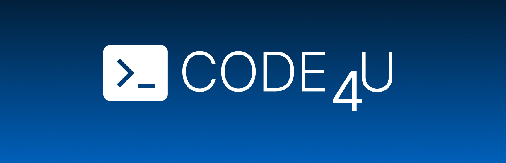
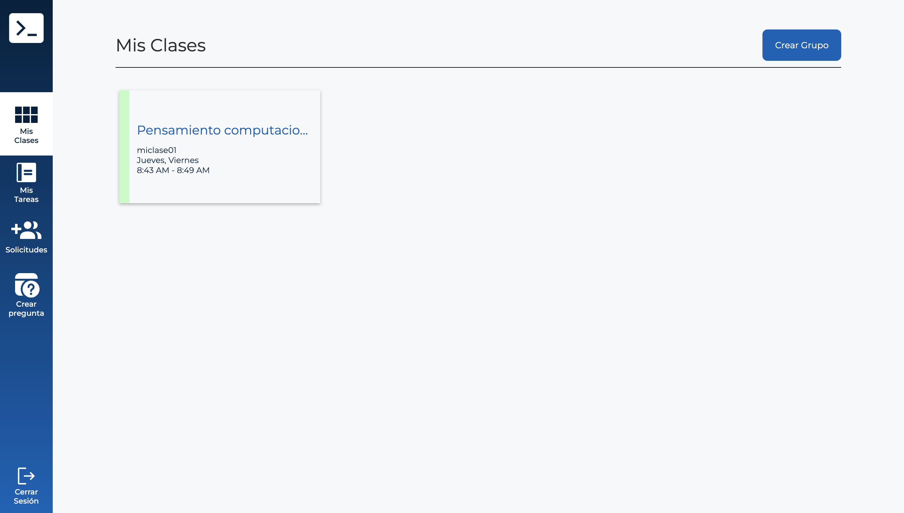
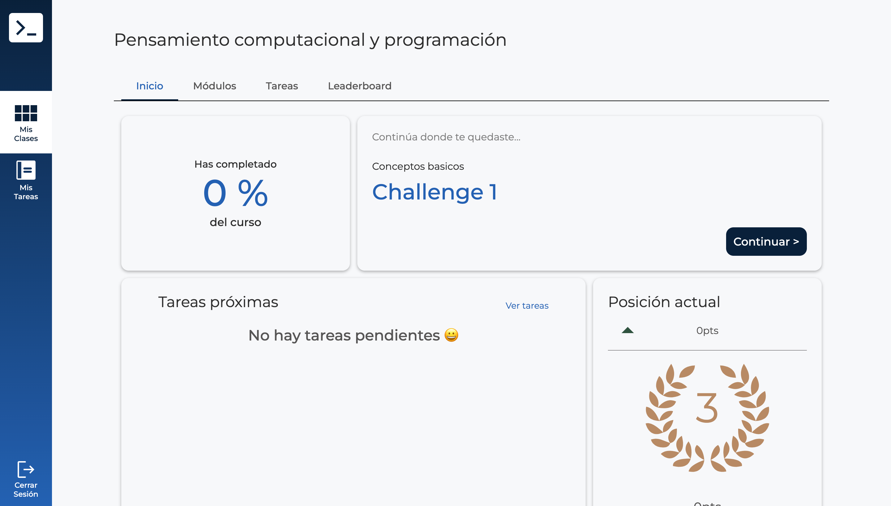
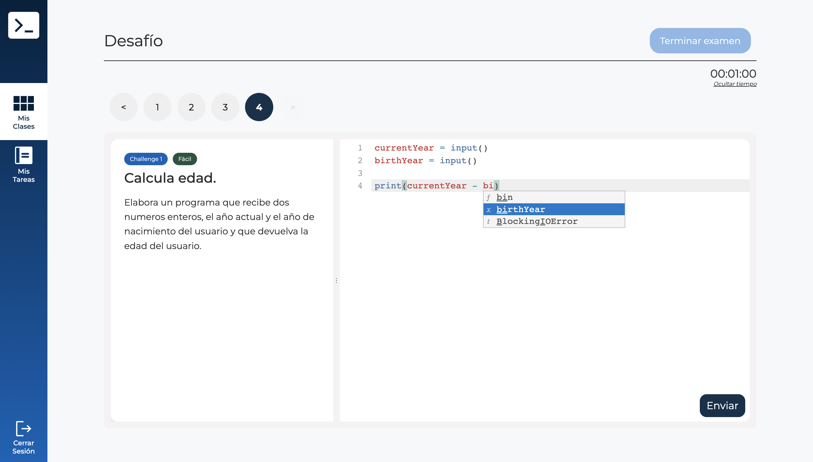
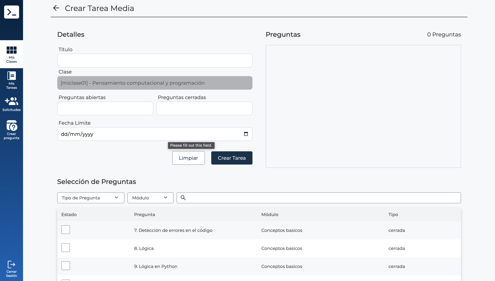

# Code4U - Frontend

Code4U is an online platform for learning how to code and programming concepts in Python. It features an onlide code editor and compiler as well as a Teacher and Student view. The purpose of this platform is to help lower the entrance barrier for those who want to get into coding.

## Usage

## Installation
### Ensure you have

* [Docker](https://www.docker.com/) version 20.0.0 or above (The platform will be mounted on a container, so Docker image will take care of the rest of dependencies)

In the project directory, you can run:

### `./init.sh`

Will create and mount the Docker image with all the required dependencies. You can edit the external and internal port on this file. By default its uses the ports 9151 and 3000 respectively. The platform will run on an Express server located in `server/index.js` with the default port 80. You can also setup this as you want.

### `npm test`

Launches the test runner in the interactive watch mode.\
See the section about [running tests](https://facebook.github.io/create-react-app/docs/running-tests) for more information.

## Environment variables

By default, the frontend is not connected to the backend, as the the API needs to be mounted. Please go to the [Code4U-server](https://github.com/Code4UHub/server) repository to learn how to install it. Once done, in the `.env` file you can setup `REACT_APP_API_URL` to where the REST API is located. All API requests will be made from this url.

## License
 
The MIT License (MIT)

Copyright (c) 2015 Chris Kibble

Permission is hereby granted, free of charge, to any person obtaining a copy of this software and associated documentation files (the "Software"), to deal in the Software without restriction, including without limitation the rights to use, copy, modify, merge, publish, distribute, sublicense, and/or sell copies of the Software, and to permit persons to whom the Software is furnished to do so, subject to the following conditions:

The above copyright notice and this permission notice shall be included in all copies or substantial portions of the Software.

THE SOFTWARE IS PROVIDED "AS IS", WITHOUT WARRANTY OF ANY KIND, EXPRESS OR IMPLIED, INCLUDING BUT NOT LIMITED TO THE WARRANTIES OF MERCHANTABILITY, FITNESS FOR A PARTICULAR PURPOSE AND NONINFRINGEMENT. IN NO EVENT SHALL THE AUTHORS OR COPYRIGHT HOLDERS BE LIABLE FOR ANY CLAIM, DAMAGES OR OTHER LIABILITY, WHETHER IN AN ACTION OF CONTRACT, TORT OR OTHERWISE, ARISING FROM, OUT OF OR IN CONNECTION WITH THE SOFTWARE OR THE USE OR OTHER DEALINGS IN THE SOFTWARE.

